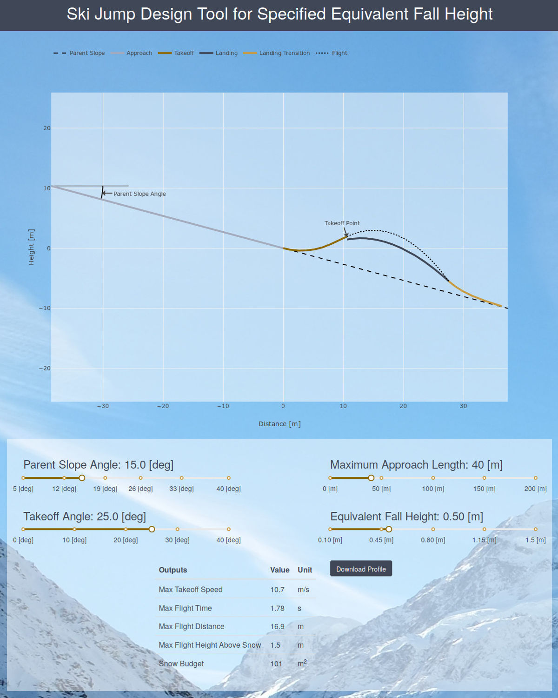

# Summary

Over the past three decades an evolution has occurred toward freestyle skiing
and snowboarding involving aerials in terrain parks at ski resorts hosting
dedicated jumping features. Today more than 95% of US ski resorts have such
jumps but these rarely, if ever, involve formal or detailed design or
engineering. Although usually tested and modified before being opened to the
public, they are often simply fabricated based on the past experience of the
builder in jump construction. Together with the increase in these jumps has
come a concomitant increase in injuries and their very high social costs.
Although omitted here, the voluminous epidemiology and financial effects of
these injuries are covered in detail in references [@Hubbard2009,  @McNeil2012,
@Levy2015, @Petrone2017].

The likelihood and severity of injury on landing are proportional to the energy
dissipated on impact, when the component of velocity of the jumper
perpendicular to the snow surface is brought to zero. This energy is naturally
measured by the "equivalent fall height" (EFH), defined as the kinetic energy
associated with the landing velocity component perpendicular to the landing
surface divided by $mg$, where $m$ is the jumper mass and $g$ is the
acceleration of gravity.

Past research [@Hubbard2009, @Swedberg2010, @McNeil2012, @Levy2015] has
developed a theoretical approach for jump design. It is based on shaping the
landing surface so the perpendicular component of landing velocity (and thus
impact landing energy and EFH) is controlled to be relatively small everywhere
impact is possible. More recent research [@Petrone2017] has presented
compelling experimental evidence that these designed jump surfaces embodying
low values of EFH are practical to build and, once built, perform as predicted
in limiting landing impact. This experimental research has demonstrated that
impact on landing can be controlled through design of the shape of the landing
surface according to the theory.

Ski resorts have been reluctant, however, to adopt this more engineered
approach to jump design, in part due to questions of feasibility, but also
because of the somewhat ponderous and complex calculations required. Some
recent efforts have been made to develop numerical software to automate these
calculations [@Levy2015] that also embodies graphical user interfaces but
these have relied on proprietary, closed-source tools and programming
environments (MATLAB). The present open source library and online application
"skijumpdesign" implemented in Python removes these restrictions and promises
to make the design method more widely available to the skiing industry.

The present online application, accessed at http://www.skijumpdesign.info
and seen in Figure 1, allows a relatively unskilled user (e.g. a terrain park
manager at a ski resort) to design a ski jump composed of three sections: the
approach, landing surface and landing transition by inputting through sliders
four independent design parameters: 1. Parent Slope Angle: The measured
downward angle of the parent slope (or a good approximation thereof) where the
jump is desired. The designed jump shape is measured from this line. 2. Maximum
Approach Length: The maximum distance along the slope above the jump that the
jumper can slide to build up speed. The jumper reaches a theoretical maximum
speed at the end of this approach and the landing surface shape provides the
same impact EFH for all speeds up to and including this maximum achievable
(design) speed. 3. Takeoff Angle: The upward angle, relative to horizontal, at
the end of the takeoff ramp, a free design parameter. 4. Equivalent Fall
Height: The desired equivalent fall height that characterizes landing impact
everywhere on this jump.

| { width=400px } |
|:--:|
| *Figure 1: Screenshot of the online application depicting the inputs (4 sliders) and outputs (graph, table, and profile file download).* |

The output of the program is a graphical display of the total jump surface
shape, a table of numerical characteristic results, and a downloadable file
describing the jump surface shape in a format useful for jump fabrication. This
interface is implemented using Flask [@Pallets2018], Dash, and Plotly
[@Plotly2015] and is suitable for use on any platform that can run a modern web
browser. Moreover, we make the interface available online for free use to
users that do not want or need to install it on their personal computer.

The online application utilizes a custom server-side Python library for
construction of the jump and output parameter calculations. The library's
algorithms are implemented using NumPy [@vanderWalt2011], SciPy [@Jones2001],
matplotlib [@Hunter2007], SymPy [@Meurer2017], Cython [@Behnel2011], pycvodes
[@Dahlgren2018] and fastcache [@Brady2014]. The library provides an application
programming interface (API) for simulating planar skiing along arbitrary
surface cross sections and two dimensional flight trajectories. This API
enables a programmer to use the tools and methods for design needs other than
the one posed herein.

# Acknowledgements

We acknowledge the assistance of Jim McNeil who aided in testing the
application before release.

# References
